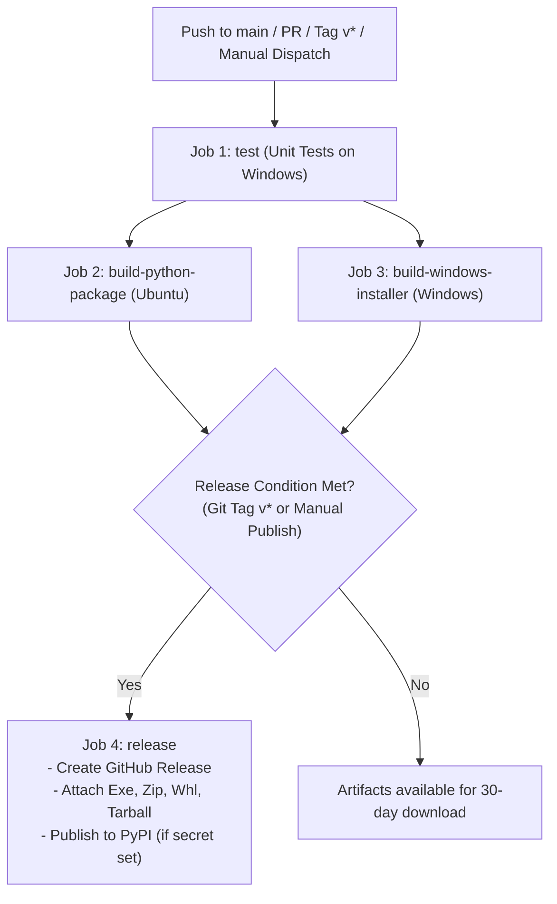

# Building and Packaging Guide for Azure TagDay & DevOps UI

This guide details how to build, test, package, and release **Azure TagDay & DevOps UI**, covering both local development builds and automated CI/CD pipelines via GitHub Actions and GitLab CI.

---

## 1. Architecture & Artifacts Overview

The project supports multiple distribution formats:

| Distribution Target | Format | Output Artifacts | Primary Audience |
| :--- | :--- | :--- | :--- |
| **Python Package** | Standard Wheel & Sdist | `dist/*.whl`, `dist/*.tar.gz` | Python users, `pip`, `uv`, PyPI |
| **Windows Setup Installer** | NSIS Executable Installer | `dist/AzureTagDayUI-Setup-<version>.exe` | End users (desktop install with shortcuts & uninstaller) |
| **Windows Portable Bundle** | Standalone Executable & Zip | `dist/azure-tagday-ui/`, `dist/azure-tagday-ui-windows-x64.zip` | Zero-install portable desktop deployment |

---

## 2. Dynamic Versioning Engine (`git describe` & `setuptools-scm`)

The project uses a dynamic, Git-driven versioning engine implemented in [`src/version.py`](file:///c:/Users/keckx/Projects/azure-tagday-ui/src/version.py):

- **Live Inspection**: Runs `git describe --tags --always --long --dirty` to extract:
  - Nearest Git release tag (e.g. `v0.01.2637`).
  - Commits ahead / distance from tag (e.g. `+3 (b95f88e)`).
  - Uncommitted changes / dirty state (`[DIRTY]`).
  - Clean exact release tag status (`is_exact_tag = True`).
- **PEP 440 Compliance**: In `pyproject.toml`, `setuptools_scm` automatically converts Git metadata into standardized version numbers (e.g., `0.1.2637` or `0.1.2637.post3+gb95f88e`) and writes `src/_version_scm.py` during builds.
- **Multi-Tier Fallback**: When running without a `.git` repository (e.g. inside an installed wheel or frozen binary), the engine resolves version information from `_version_scm.py`, `importlib.metadata`, or static defaults.

---

## 3. Prerequisites & Development Setup

### System Requirements
- **Python**: 3.9 or higher (Python 3.11, 3.12, or 3.14 recommended).
- **Fast Package Manager**: [`uv`](https://github.com/astral-sh/uv) (recommended) or standard `pip`.
- **Windows Installer Compiler** *(Optional, for `.exe` installer)*:
  - [NSIS (Nullsoft Scriptable Install System)](https://nsis.sourceforge.io/) — executable `makensis.exe` in `PATH` or standard directory `C:\Program Files (x86)\NSIS`.
  - Alternatively, [Inno Setup 6](https://jrsoftware.org/isinfo.php) (`ISCC.exe`).

### Installing Dependencies

Using `uv` (recommended):
```powershell
# Sync full development environment
uv sync
```

Using standard `pip`:
```powershell
pip install -e .
pip install pyinstaller pytest build wheel twine
```

---

## 4. Local Build Instructions

### A. Building Python Wheel & Source Distribution (`.whl` / `.tar.gz`)

Run with `uv`:
```powershell
uv build
```

Or using the standard Python `build` module:
```powershell
python -m build
```

This generates:
- `dist/azure_tagday_ui-<version>-py3-none-any.whl`
- `dist/azure_tagday_ui-<version>.tar.gz`

To verify package metadata integrity:
```powershell
twine check dist/*
```

---

### B. Building Windows Standalone Executable & NSIS Setup Installer

Run the all-in-one build script:
```powershell
python build_installer.py
```

What `build_installer.py` performs:
1. Resolves dynamic version from `src.version`.
2. Runs **PyInstaller** against [`azure-tagday-ui.spec`](file:///c:/Users/keckx/Projects/azure-tagday-ui/azure-tagday-ui.spec), bundling PySide6 Qt Quick/QML views, Jinja2 templates, and configs into `dist/azure-tagday-ui/`.
3. Creates a portable zip archive `dist/azure-tagday-ui-windows-x64.zip`.
4. Compiles the modern NSIS installer [`installer.nsi`](file:///c:/Users/keckx/Projects/azure-tagday-ui/installer.nsi) with `-DPRODUCT_VERSION=<version>`, outputting `dist/AzureTagDayUI-Setup-<version>.exe`.
5. Compiles Python `.whl` and `.tar.gz` packages.

---

## 5. Testing & Verification

### Running Automated Unit Tests
```powershell
# Run the complete test suite
pytest

# Run tests with short tracebacks
pytest -q

# Run specific version detection tests
pytest src/tests/test_version.py
```

### Testing Standalone GUI Execution
```powershell
# Test GUI startup in headless/non-interactive test mode
python -m gui --test
```

### Testing Wheel Installation in Clean Environment
```powershell
# Test installation into an isolated environment
pip install dist/azure_tagday_ui-*.whl

# Launch installed CLI or GUI commands
azure-tagday-ui
tagday --help
```

---

## 6. GitHub Actions CI/CD Pipeline

The repository includes a comprehensive GitHub Actions CI/CD workflow configured in [`.github/workflows/build-and-publish.yml`](file:///c:/Users/keckx/Projects/azure-tagday-ui/.github/workflows/build-and-publish.yml).

### Workflow Diagram



### Pipeline Jobs Breakdown

| Job | Runner | Key Operations | Artifacts Generated |
| :--- | :--- | :--- | :--- |
| **`test`** | `windows-latest` | • Clones with `fetch-depth: 0`<br/>• Sets up Python 3.12 & `uv`<br/>• Runs full `pytest` suite | Test execution status & logs |
| **`build-python-package`** | `ubuntu-latest` | • Runs `uv build`<br/>• Runs `twine check dist/*` | `python-packages` (`*.whl`, `*.tar.gz`) |
| **`build-windows-installer`** | `windows-latest` | • Installs NSIS via Chocolatey<br/>• Runs `python build_installer.py`<br/>• Bundles portable `.zip` | `windows-installer` (`AzureTagDayUI-Setup-*.exe`, `*.zip`) |
| **`release`** | `ubuntu-latest` | • Triggers on `v*` tags or manual release dispatch<br/>• Creates GitHub Release with release notes<br/>• Attaches `.exe`, `.zip`, `.whl`, `.tar.gz`<br/>• Publishes to PyPI if `PYPI_API_TOKEN` exists | Published GitHub Release & PyPI Package |

---

## 7. Release Process (Publishing a New Version)

To publish a new official release:

1. **Tag a Release Commit**:
   ```bash
   git checkout main
   git pull
   git tag v0.01.2638
   git push origin v0.01.2638
   ```

2. **Automated CI/CD Execution**:
   - GitHub Actions will detect the `v*` tag.
   - Run the unit tests to ensure stability.
   - Build all distribution packages and the Windows NSIS installer.
   - Publish a new **GitHub Release** with all 4 binaries attached.
   - If `PYPI_API_TOKEN` secret is configured in repository settings (`Settings -> Secrets and variables -> Actions`), the package is uploaded to PyPI automatically.

3. **Manual Trigger (Optional)**:
   - In GitHub Actions UI, navigate to `Build & Publish Artifacts`.
   - Click `Run workflow`, choose branch, and check `Publish GitHub Release & PyPI`.
